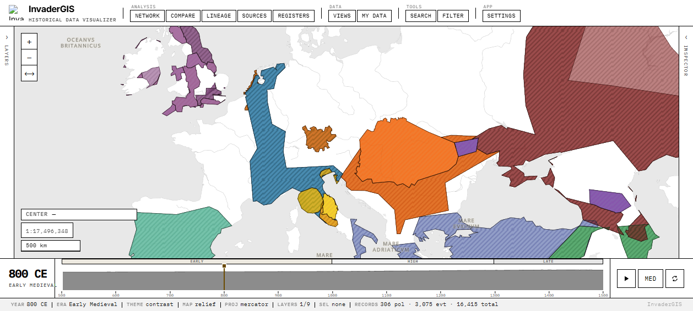
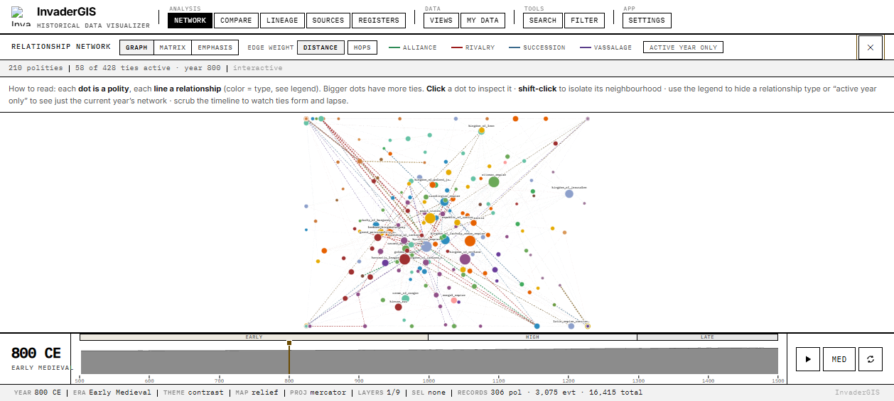
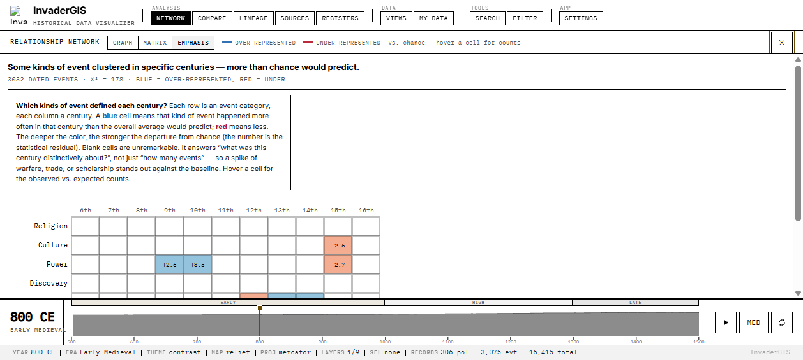

<div align="center">

# InvaderGIS

### A custom GIS for historical research, built from scratch.

Everything under it was written for it: the map stack, the time model, the data
spine, the record schema, the analytical views, the theme engine.

[](https://github.com/g-lanza/InvaderGIS/actions/workflows/ci.yml)
[](https://github.com/g-lanza/InvaderGIS/actions/workflows/deploy.yml)
[](#the-dataset)
[](#architecture)
[](#built-from-scratch)
[](#licences)
[](#licences)

### [▶&nbsp; Open the live demo](https://g-lanza.github.io/InvaderGIS/)

</div>



---

## At a glance

- **16,415 sourced records** across 15 kinds, every one traceable to a real citation.
- **Medieval Europe and the wider world, 500–1500 CE.** Scrub the year and the whole
  map redraws.
- **5 runtime dependencies** behind 207 source files and roughly 53,700 lines.
- **No backend.** A static page. Once it loads, nothing leaves your machine.
- **Runs on a phone.** The mobile build has a shell of its own: full-bleed map, one
  draggable drawer, real touch targets.

---

## What it is

InvaderGIS puts a real, sourced historical dataset on a map and lets you move
through time. Drag the year scrubber and the workspace updates live: polity
polygons grow and dissolve, events accrete, journeys trace, relationships connect.
Every fact on screen resolves to a source record. Nothing is invented.

The first dataset covers **Medieval Europe and the wider world, 500–1500 CE**. The
engine itself is dataset-general. That corpus loads into a generalized schema, so
another historical dataset can be added without forking the app.

---

## The dataset

**16,415 sourced records across 15 kinds:**

| Kind | Count | | Kind | Count |
|---|---:|---|---|---:|
| Claims | 4,123 | | Rulers | 285 |
| Settlements | 4,077 | | Capitals | 230 |
| Events | 3,075 | | Journeys | 152 |
| Military sites | 2,055 | | Institutions | 92 |
| Texts | 1,097 | | Technologies | 18 |
| Sources | 458 | | Annotations | 12 |
| Relationships | 428 | | Research questions | 7 |
| Polities | 306 | | **Total** | **16,415** |

Language is an attribute of each polity, covering primary language, language
make-up and administrative language. It shows up in the polity's Demographics tab.
There is no separate language record kind.

---

## What it does

### Map and time

- **Time-scoped map.** Polity polygons, capitals, settlements, military sites,
  journeys, trade routes and relationship arcs, all filtered to the active year.
  Hover for a tip, click to inspect. MapLibre loads lazily, so the opening shell
  stays small.
- **Chronoscope.** A year scrubber across 500–1500 CE with era bands and playback.
  Move it and the whole workspace redraws live.
- **Layers and legend.** Collapsible layer groups, per-layer opacity, and a live
  colour legend for event categories, region tints and relationship types.
- **Measure tool.** Click points on the map for great-circle distance and area,
  computed locally.

### Reading the record

- **Inspector.** A full detail surface per record. Polities get a tabbed profile
  (Overview, Demographics, Economy, Lifecycle, Connections, Sources) with charts
  drawn from the record itself. Every claim carries its provenance and citations.
- **Registers and sources.** Sortable attribute tables per record kind, plus the
  full bibliography of all 458 source records behind the corpus.

### Analysis

- **Relationship network.** A force-directed graph, filterable by relationship
  type, with an active-year-only mode and a live tie count.
- **Adjacency matrix.** Who bordered, allied with, or fought whom.
- **Emphasis matrix.** Which event categories defined each century, scored against
  what chance alone would predict.
- **Lineage.** A ruler Gantt with succession lines drawn from real reign data.
- **Compare and storyline.** A side-by-side attribute table and a two-entity
  narrative thread.

### The workspace

- **Search and command palette.** `⌘K` / `Ctrl-K` fuzzy search, year-jump and slash
  commands, plus a prose (TF-IDF) search over the same index.
- **Shareable links.** Active year, theme, map style and selection all live in the
  URL hash, so any view can be bookmarked or sent to someone.
- **Saved views.** Pin a configured workspace and come back to it.
- **Four themes, three map styles.** Atlas, Manuscript, Dark, Contrast; Parchment,
  Plain, Relief. All switch live with no reload.
- **My Data.** Drop in your own GeoJSON or CSV to plot alongside the historical
  layers. It stays in your browser and is never transmitted.
- **Mobile.** The phone build has its own shell: full-bleed map, one draggable
  drawer, 44px touch targets, and a render-resolution cap that keeps playback
  smooth on phone GPUs.
- **Installable.** Ships a web app manifest, so it can go on a home screen and
  launch standalone.
- **Guided tour.** A first-open walkthrough, replayable from Settings → Guides,
  which also holds the manual, data sources, attribution and licences.

| Relationship network | Event emphasis over time |
|---|---|
|  |  |

---

## Built from scratch

Almost none of this is off the shelf. **207 source files** and roughly **53,700
lines** sit on **five runtime dependencies**: `maplibre-gl`, `pmtiles`, `react`,
`react-dom`, `zustand`.

Each row below was written for this project. The middle column is what most builds
would have installed.

| Built here | The usual shortcut | Where |
|---|---|---|
| **18 chart components in hand-written SVG:** timelines, Sankey, Gantt, donut, matrices, force graph | A charting library | [`src/charts/`](src/charts/) |
| **10 map layer modules** written straight against the MapLibre style spec: polities, capitals, settlements, military, journeys, trade, relationships, events, heatmap, cartogram | A mapping abstraction layer | [`src/map/`](src/map/) |
| **Force-directed layout, lineage layout, residual/emphasis statistics** | d3-force, a stats package | [`forceLayout.ts`](src/charts/forceLayout.ts), [`lineageLayout.ts`](src/charts/lineageLayout.ts), [`residualStats.ts`](src/charts/residualStats.ts) |
| **Great-circle geodesy** for the measure tool | turf.js | [`geodesy.ts`](src/map/geodesy.ts) |
| **Fuzzy command matching and TF-IDF prose search** over a prebuilt index | fuse.js, lunr | [`CommandBarFuzzy.ts`](src/components/CommandBarFuzzy.ts) |
| **A prebuilt by-year index** giving O(1) year scrubbing over 16,415 records | Re-filtering the corpus every tick | [`loaders.ts`](src/data/loaders.ts) |
| **A four-theme design-token engine** with no hard-coded colour outside the tokens | A component library's theming | [`tokens.ts`](src/design/tokens.ts), [`atlas-tokens.css`](src/styles/atlas-tokens.css) |
| **A dedicated phone shell** with its own drawer model | A responsive-breakpoint retrofit | [`src/components/mobile/`](src/components/mobile/) |
| **A migrate → validate → bake pipeline** with a revert log | An ETL framework | [`scripts/`](scripts/) |

---

## Design principles

1. **Everything is real.** No mock data, no fake components. Unfinished work is a
   clearly marked stub, never a convincing-looking placeholder.
2. **Every fact is sourced.** No record claim without `provenance.sources_used`
   resolving to a real `source` record. No date, ruler or border is invented.
   Citations point to the underlying scholarly source, and shaky claims are marked
   weakly attested.
3. **Data safety is absolute.** No script or migration destroys source data. Every
   migration reads old, writes new, and keeps a revert log.
4. **One token tree, four themes.** No hard-coded hex, radius or shadow outside the
   design tokens. Square corners, hairline borders, no panel shadows, correct in
   all four themes.

---

## Architecture

A static SPA. The browser fetches baked JSON and GeoJSON, then builds an in-memory
year index once at load. Every scrub after that is a lookup into that index. State
lives in **12 focused Zustand stores**: time, selection, filters, layers, settings,
saved views, compare, and so on.

Data flows outside-in. Every stage reads old and writes new:

```
data/<kind>/*.json
   │  migrate.mjs   read old records → contract records (+ revert log; derives,
   │                never fabricates — e.g. ruler succession from real reign data)
   ▼
data/  (validated)
   │  validate.mjs  schema + reference integrity + date ordering + dataset window
   │                + geometry bounds + licence field checks (CI fails on error)
   ▼
   │  bake-manifests.mjs   write static artifacts
   ▼
public/data/records/<kind>.json     per-kind record bundles
public/data/layers/*.geojson        map layers (coords in GeoJSON order)
public/index/{search,adjacency}.json + by-year/<year>.json
   │
   ▼  loaders.ts fetch at runtime → in-memory year index (O(1) scrub)
```

Build-time ingesters ([`scripts/ingest/`](scripts/ingest/)) pull upstream data
offline, validating and sanitising every external field at the boundary. **The
shipped app makes no external calls at all.**

---

## Quality gates

Every push and pull request runs the same checks a human runs locally
([`ci.yml`](.github/workflows/ci.yml)):

| Gate | What it covers |
|---|---|
| `npm run validate` | Schema, reference integrity, date ordering, dataset window, geometry bounds and licence fields across all 16,415 records. CI fails on error. |
| `npm test` | **125 unit tests** across 14 suites: year filtering, geodesy, URL state, fuzzy matching, import parsing, adjacency, residual statistics. |
| `npm run test:e2e` | **12 Playwright specs at 6 viewports** (320 / 375 / 390 / 414 / 768 / 1280) with screenshot capture, so the phone shell cannot regress unnoticed. |
| `npm run lint` | ESLint 9 flat config, TypeScript-aware. |
| `npm run typecheck` | `tsc --noEmit`, TypeScript 5 strict. |
| `npm run build` | Full production build. Catches broken output before it ships. |

Run all of it with `npm run check`.

**Security.** A strict Content-Security-Policy with `script-src 'self'` and
`connect-src 'self'`, so no CDN scripts and no third-party origins. Plus `nosniff`,
`X-Frame-Options: DENY`, HSTS, a locked-down `Permissions-Policy`, and
`frame-ancestors 'none'`. Uploaded user data is parsed and stored in the browser
and never transmitted.

---

## Run it locally

Requires **Node 18+**. CI runs 20.

```bash
git clone https://github.com/g-lanza/InvaderGIS.git
cd InvaderGIS
npm install
npm run dev      # bakes data, then serves at http://localhost:5173
```

The app fetches baked JSON/GeoJSON at runtime instead of bundling it, so
`npm run bake` (`data/` → `public/data/` + `public/index/`) has to run first. Both
`dev` and `build` run it automatically through their `pre*` hooks.

```bash
npm run build      # bake → tsc --noEmit && vite build → dist/ (static SPA)
npm run validate   # schema / reference / window / licence checks on data/
npm run check      # lint + typecheck + test + build
npm run test:e2e   # Playwright, all six viewports
```

---

## Repo map

```
src/
  map/          MapLibre layer stack, interactions, geodesy, measure tool
  charts/       18 hand-written SVG charts, their layout and stats maths
  panels/       Inspector, entity tabs, record cards, provenance blocks
  components/   App shell, command bar, time rail, layer rail, mobile shell
  stores/       12 Zustand stores (time, selection, filters, layers, …)
  data/         Loaders, year index, URL state, filter predicates
  design/       Design tokens, crest, glyph marks
  upload/       My Data GeoJSON/CSV import, IndexedDB store
  styles/       Token tree and per-surface stylesheets
scripts/
  migrate/      Record migrations, read old / write new, with revert log
  validate/     Schema, reference, window and licence validation
  build/        Bake manifests, indexes, layers, OG banner
  ingest/       Offline upstream ingestion
data/           Source records, one JSON file per record, by kind
public/data/    Baked runtime artifacts (generated, do not hand-edit)
e2e/            Playwright specs, responsive screenshot baselines
docs/           Sourcing policy, design notes, images
```

---

## Deployment

A static SPA. Host `dist/` anywhere.

- **GitHub Pages.** [`deploy.yml`](.github/workflows/deploy.yml) bakes, builds and
  publishes on every push to `main`.
- **Netlify.** [`netlify.toml`](netlify.toml) covers the build, the SPA fallback and
  the full security-header set.

The production build serves from the `/InvaderGIS/` base path, set in
[`vite.config.ts`](vite.config.ts). Change it to match your repo name, or to `/`
for a root or custom domain. Runtime asset URLs resolve against that base
automatically.

---

## Data sources

The dataset incorporates the upstream sources below. Reusing the data means
respecting both the project licences and every upstream licence here. See
[`ATTRIBUTIONS.md`](ATTRIBUTIONS.md) for the canonical detail and
[`docs/SOURCING.md`](docs/SOURCING.md) for the sourcing policy.

| Source | Contribution | Licence | SPDX | Share-alike |
|---|---|---|---|:---:|
| [Wikidata](https://www.wikidata.org/) | QID backbone; dates, capitals, rulers | CC0 1.0 | `CC0-1.0` | no |
| [PLEIADES](https://pleiades.stoa.org/) (ISAW, NYU) | Settlement gazetteer; capital coordinates | CC BY 3.0 | `CC-BY-3.0` | no |
| [Cliopatria](https://github.com/aourednik/historical-basemaps) | Historical polity polygon shapes | CC BY-SA 4.0 | `CC-BY-SA-4.0` | **yes** |
| [Natural Earth](https://www.naturalearthdata.com/) | Coastlines, rivers, lakes, graticule | Public domain | `publicdomain` | no |
| [OpenHistoricalMap](https://www.openhistoricalmap.org/) | Historical settlements, routes | ODbL 1.0 | `ODbL-1.0` | **yes** |

PLEIADES and the two share-alike sources (Cliopatria, OpenHistoricalMap) require
credit on redistribution. Check the share-alike obligations before building a
derivative product.

---

## Licences

A two-licence split. See [`LICENSE`](LICENSE).

| Layer | Covers | Licence | SPDX |
|---|---|---|---|
| **Software** | App code, scripts, styles, docs | PolyForm Noncommercial 1.0.0 | `LicenseRef-PolyForm-Noncommercial-1.0.0` |
| **Data** | Curation, schema and aggregation of the dataset | CC BY-NC 4.0 | `CC-BY-NC-4.0` |

Both permit research, study and personal use. **Commercial use of either layer
requires prior written permission.** Open an issue to request it.

The CC BY-NC 4.0 licence covers the curation, schema and aggregation. It does not
override the upstream licences on the raw imported facts, so check
[Data sources](#data-sources) too.

---

## Tech stack

React 18 · Vite 5 · MapLibre GL 4 (lazy-loaded) · Zustand 4 · TypeScript 5 (strict)
· Vitest · Playwright. No charting library. No backend. A static page that runs
entirely in the browser.

<div align="center">

**[▶&nbsp; Open the live demo](https://g-lanza.github.io/InvaderGIS/)**

If this is useful or interesting, a ⭐ helps.

</div>
